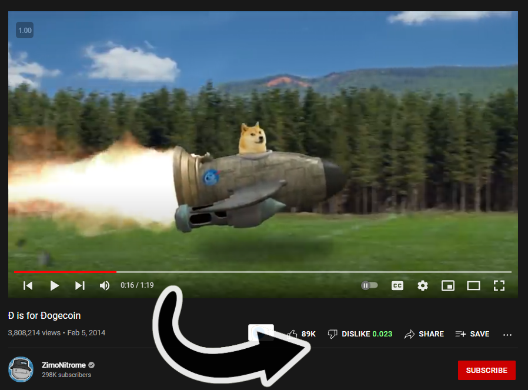

# YouTube Dislike Estimator

Estimates the removed YT Dislike #BringBackDislikes

## Usage

A. Installation

1. Install the [Tampermonkey • Chrome](https://www.tampermonkey.net/) Chrome extension or [Greasemonkey](https://addons.mozilla.org/en-US/firefox/addon/greasemonkey/) for Firefox.
2. Install the userscript [here](https://github.com/yuis-ice/YouTube-Dislike-Estimator/raw/main/userscript/main.user.js).

B. How it works 

1. The program gets video's views, likes data for the video, and calculates the **likes/views ratio** when you visit a video page on YouTube
2. It stores the data to your browser's built-in database, local storage
3. It compares the video's l/v ratio to the stored l/v ratios
4. It shows you the l/v ratio w/ a visual-friendly red-like or green-like colorization
5. The data has been stored in the **_yt_dislike_estimator** field on LS. 

C. Usage

1. Install it first.
2. Visit a video on YouTube as usual. It should show the l/v ratio for the video.
3. When it doesn't show, reload the page might work. Or open a new issue here.
4. The more you visit videos, the more the data will be accurate.
4. Profit. 

## License

This software is released under the GPL-3 license terms. 
Free for share, modification, commercial uses under the terms. 
For the detail see the LICENSE.
